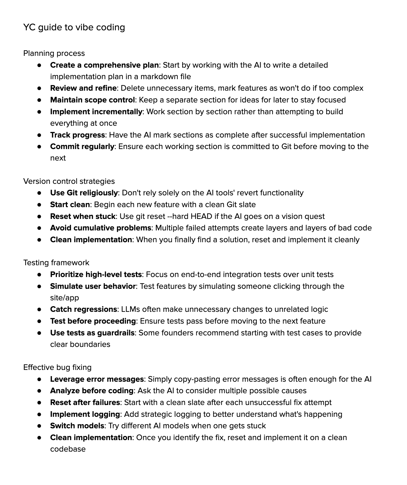

# Agentic Coding at Modus vs Vibe Coding

## Our Rule of Thumb

> If you wouldn’t merge that code from a human junior dev without reading it, don’t do it for an LLM either.

“Vibe coding” is a term popularized by Andrej Karpathy to describe a casual, intuition-led approach to programming with AI, where developers rely heavily on code suggestions and iterations without overthinking or deeply reviewing each step. It's most commonly used for:

- Exploration and prototyping: You lean into the AI’s suggestions, quickly iterating on ideas or building throwaway features.
- Rapid UIs and scripts: When time-to-value matters more than polish.
- Learning and discovery: Trying absurd ideas, seeing what sticks, and building intuition for how LLMs behave.

A typical vibe coding session might look like:

```
“Make the button redder.”
```

```
“Now fetch the data from that API.”
```

```
“Oops, that didn’t work — here’s the error message, fix it.”
```

> It’s fast. It's fun. But it’s not a production workflow.

## Our definition

> Agentic Coding is not about giving up control. It’s about shifting your mindset from manually writing every line of code to collaborating with AI agents to move faster, stay in flow, and reduce cognitive load — without compromising on quality or safety.

### What Agentic Coding is

- A way to speed up development using AI tools (like Copilot, Cursor, Claude, etc.) to generate scaffolds, functions, test cases, and boilerplate.
- A workflow focused on goal-driven prompting and quick iterations, reducing time spent on syntax and boilerplate so you can focus on product logic.
- A creative, exploratory process where developers guide the AI with clear intentions and validate the results critically.
- A team-level practice that works best when paired with strong code review, automated tests, and shared engineering standards.
- A mindset of "pairing with AI" — not replacing your thinking, but accelerating it.

### What Agentic Coding is not

- It's not about accepting AI suggestions blindly without review or testing.
- It's not an excuse to skip documentation, validation, or best practices.
- It’s not a replacement for design discussions, team alignment, or system thinking.
- It’s not a solo act — it benefits from shared learnings, reusable prompts, and peer review.
- It’s not a shortcut to skip understanding — it’s a tool to speed up understanding and execution.

Agentic Coding is not a license for careless software engineering. When AI becomes your coding partner, the developer's role shifts — not disappears. On our team:

- We never accept code blindly from an LLM.
- We enforce code reviews — AI-generated or not.
- We test everything. If the code hasn’t run, it doesn’t exist.
- We document AI usage decisions and implementation tradeoffs.

## Core Principles of Agentic Coding

To code with agents effectively — and responsibly — developers must adopt a mindset that balances speed with structure. The following principles guide how we approach AI-assisted software development at Modus Create:

- **Prompt with intent**: Every coding session begins with clear goals. You don’t just "ask the AI to code" — you guide it with purpose. Good prompting is focused, testable, and grounded in real requirements.
- **Work in small, shippable units**: AI is most effective when given scoped, incremental tasks. Break work down into vertical slices and implement one behavior at a time. Large, vague prompts lead to hallucination and low-quality output.
- **Stay in flow, but don’t skip validation**: Agentic coding is about reducing cognitive load — not cutting corners. Test early. Validate output. Use pre-commit hooks, linters, and self-correction loops to enforce quality along the way.
- **Use version control deliberately**: Reset when stuck. Commit often. Don’t stack partial attempts or let unclear state accumulate — clean starts are cheaper than debugging bloated AI output.
- **AI is a collaborator, not a replacement**: Your job doesn’t disappear — it evolves. You review the code, manage the plan, and make the architectural decisions. If you wouldn’t accept sloppy work from a junior developer, don’t accept it from a model either.
- **Exploration is encouraged — with boundaries**: Use common vibe coding for prototyping, learning, and generating ideas. But when you move to production, apply rigor. Reuse what works, test what matters, and document what changes.
- **Structure beats speed in the long run**: Following structured workflows (like “Explore → Plan → Code → Commit”) leads to better outcomes than fast, unstructured iteration. The fastest way to ship is building clean, testable, maintainable code — even with AI.

## References



- [Vibe Coding Is The Future](https://www.ycombinator.com/library/ME-vibe-coding-is-the-future)
- [How To Get The Most Out Of Vibe Coding](https://www.ycombinator.com/library/MN-how-to-get-the-most-out-of-vibe-coding)

## Keep Reading

[Getting Started](./GETTING_STARTED.md)