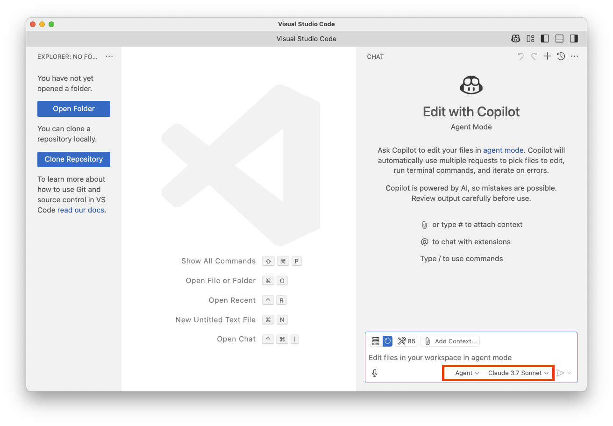

# Getting Started

To work effectively with AI coding agents at Modus Create, your first step is setting up GitHub Copilot Agent inside Visual Studio Code.

- **Install Visual Studio Code**: If you’re not already using VS Code you Download and install it here [Visual Studio Code Setup Guide](https://code.visualstudio.com/docs/setup/setup-overview);

- **Request Your GitHub Copilot Subscription**: Modus provides GitHub Copilot licenses for all engineers. Before setting up Copilot, you must request your subscription by requesting at [Modus IT Service Desk Portal](https://moduscreate.atlassian.net/servicedesk/customer/portals);

- **Install GitHub Copilot Extension**: Install the GitHub Copilot extension by following the guide at [GitHub Copilot for VS Code](https://code.visualstudio.com/docs/copilot/setup);

- **Enable GitHub Copilot Agent Mode**: As of today, April 28th 2025, Agent mode requires to be manually enabled by following the guidance at [Copilot Agent Mode Setup](https://code.visualstudio.com/docs/copilot/chat/chat-agent-mode);

After going through the above steps, you should be able to see the agent option:

## References

- [Copilot agent mode new features in Visual Studio Code | GitHub Checkout](https://www.youtube.com/watch?v=aKx5I0Mrr9g)
- [VS Code Agent Mode Just Changed Everything](https://www.youtube.com/watch?v=dutyOc_cAEU)

## Keep Reading

[Managing the Agent Context](./CONTEX.md)